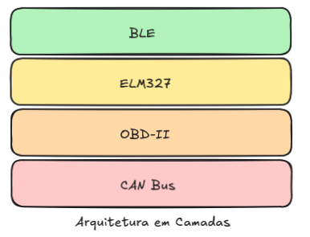
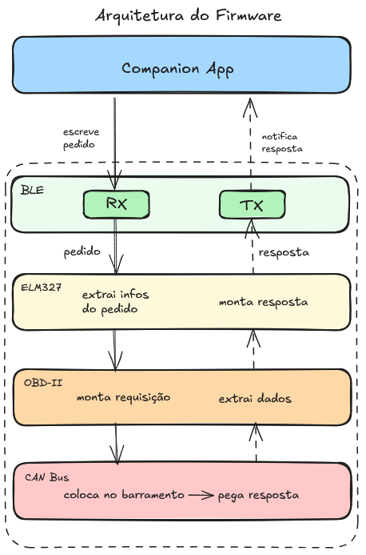

# tccelta
Repositório para o Trabalho de Conclusão de Curso do Bacharelado em Engenharia de Computação da Escola Politécnica da Universidade de São Paulo.

# Sumário

1. [Introdução](#introdução)
1. [Arquitetura](#arquitetura)
1. [Funcionamento Típico](#funcionamento-típico)
1. [Segurança](#segurança)

# Introdução [↩](#sumário)

> Obs: recomenda-se a leitura dos texto auxiliar [CAN e OBD-II](docs/can-e-obd2.md).

Este repositório contém um firmware para um Dongle OBD-II baseado em ESP-32 na pasta `esp32-firmware/`. Ele utiliza o [PlatformIO](https://platformio.org/) para gerenciar as dependências e o build e o upload do firmware.

Com o PlatformIO devidamente instalado e configurado em seu VSCode, conecte o ESP32 ao seu computador e abra a pasta esp32-firmware com o VSCode. Após isto, é possível abrir a interface da extensão e escolher qual dos perfis, configurados no arquivo `esp32-firmware/platformio.ini`, deve ser utilizado para Build e Upload. Cada perfil irá definir variáveis de ambiente, que são utilizadas em macros no código, as quais decidem quais implementações instanciar.

# Arquitetura [↩](#sumário)

O firmware está estruturado em camadas, conforme a seguinte imagem:

Cada camada na imagem concretiza-se como uma pasta dentro de esp32-firmware/src. Cada pasta contém um arquivo .h com a interface da camada, e pode possuir uma ou mais implementações. Como cada camada comunica-se somente com a camada inferior através de sua interface padronizada, é possível trocar a implementação de uma dada camada sem maiores impactos no código. Por exemplo, para fins de desenvolvimento da comunicação Esp32 - Companion App, pode ser um estorvo ter que fazer todo o setup envolvendo os componentes físicos do dongle que interagem com o CAN. Por isso, é possível instanciar a camada OBD-II mockada, que retorna respostas construídas e dispensa a necessidade de componentes CAN. 

Abaixo, é possível observar mais detalhes sobre as responsabilidades de cada camada:

# Funcionamento Típico [↩](#sumário)
O funcionamento típico é o seguinte: 

1. No Setup, as características BLE são configuradas; as implementações de cada camada, escolhidas via variáveis de ambientes no perfil PlatformIO escolhido, são instanciadas; os métodos de inicialização relevantes são executados; e o dispositivo começa a se anunciar.
2. Um cliente BLE conecta-se ao dispositivo.
3. Um cliente BLE escreve um comando ELM327 na característica RX do BLE.
4. O callback `onWrite` da classe `BLEConnectivity` executa, e como consequência o comando ELM327 recebido é colocado na fila à qual a tarefa `ELM327Task` escuta.
5. A tarefa `ELM327Task` reage à entrada do comando na fila, e inicia o seu processamento chamando o método `process` da classe ELM327.
6. Consequentemente, pode ser gerada uma requisição à camada OBD-II. Se a implementação escolhida for a mockada, alguma lógica executará no sentido de gerar uma resposta coerente. Se a implementação escolhida for a real, será construída uma requisição OBD-II (que, conforme a [documentação CAN e OBD-II](docs/can-e-obd2.md), viverá no campo DATA da mensagem CAN). Então, será repassada para a camada CAN, que interagirá com o componente CAN relevante para colocar a requisição no barramento, esperar uma resposta, e retornar seu conteúdo.
7. A resposta OBD-II será processada e colocada no TX do BLE.
8. O cliente será notificado e poderá fazer o que bem entender com a resposta do DONGLE ao seu comando ELM-327 =)

# Segurança [↩](#sumário)

Uma consequência interessante da organização em camadas é que, para implementação da segurança na comunicação ESP32 - App, só é necessário intervir na camada BLE. 

Neste projeto, a abordagem escolhida foi a implementação do Padrão Decorator, na qual uma nova classe, `SecureBLEConnectivity`, encapsulará a classe `BLEConnectivity`, interceptando chamadas à mesma, executando operações antes de chamar a classe interna, com o intuito de fornecer serviços de segurança. Um esquema simplificado é apresentado abaixo:

Fica claro que as capacidades BLE implementadas pela `BLEConnectivity`, como configuração das características, transmissão da resposta via TX e recebimento de comandos via RX, são preservadas. A classe `SecureBLEConnectivity` é transparente para as outras camadas.

Esta classe deverá implementar as operações de cifração e decifração; verificar a autenticidade das mensagens recebidas e autenticar as mensagens enviadas; e autenticar o cliente antes de aceitar sua conexão. 
