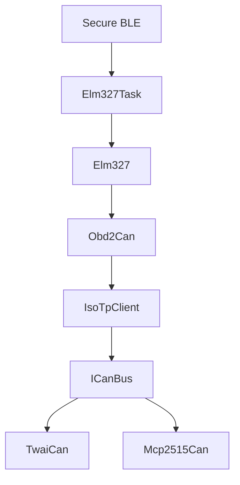
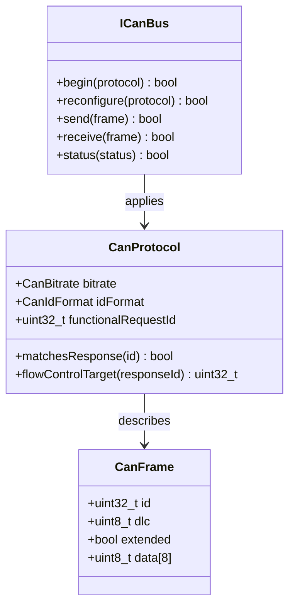
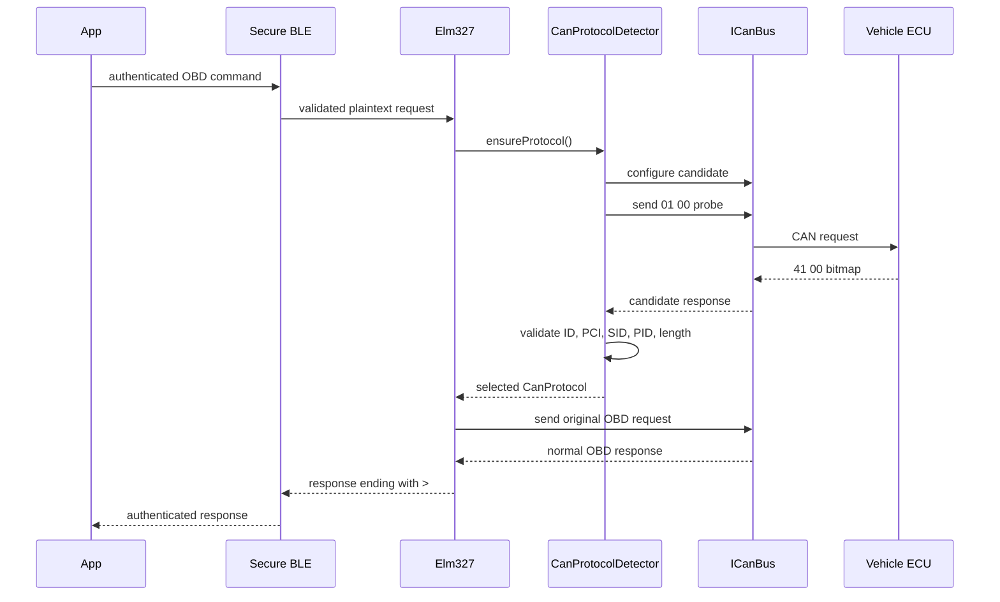
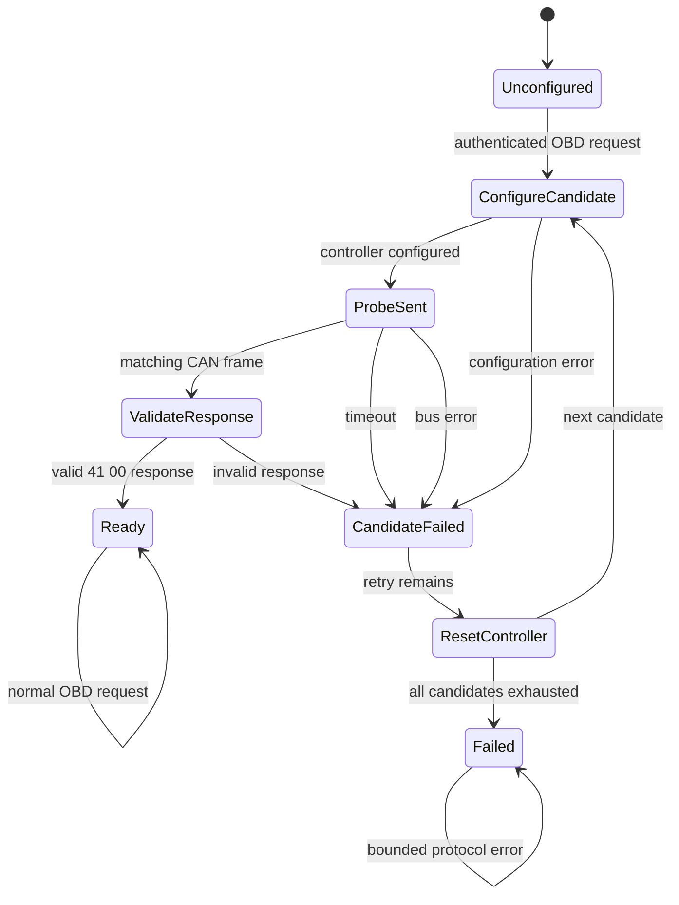
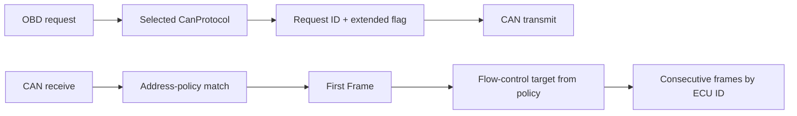
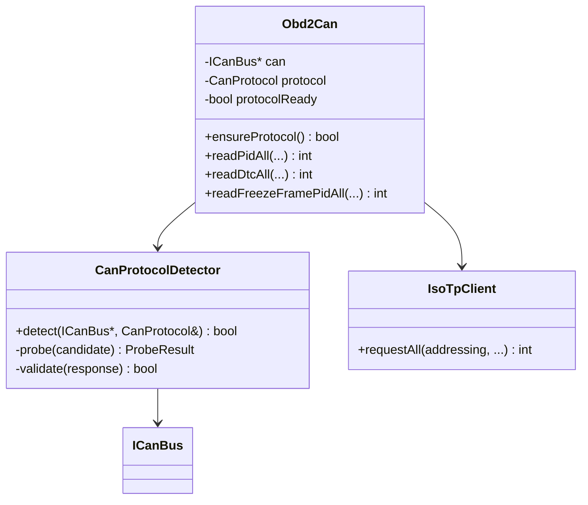
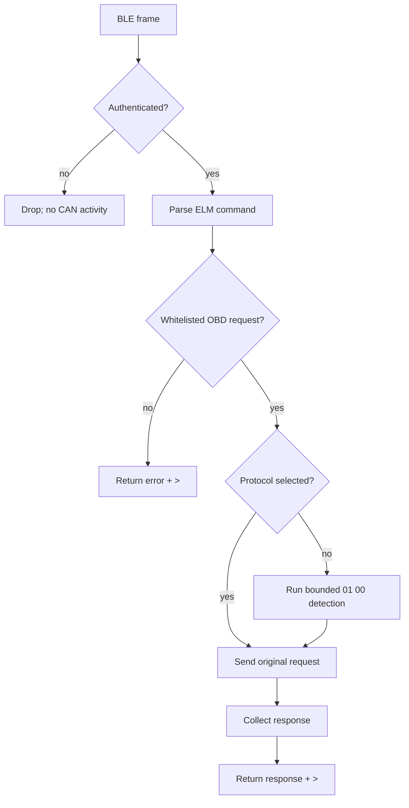
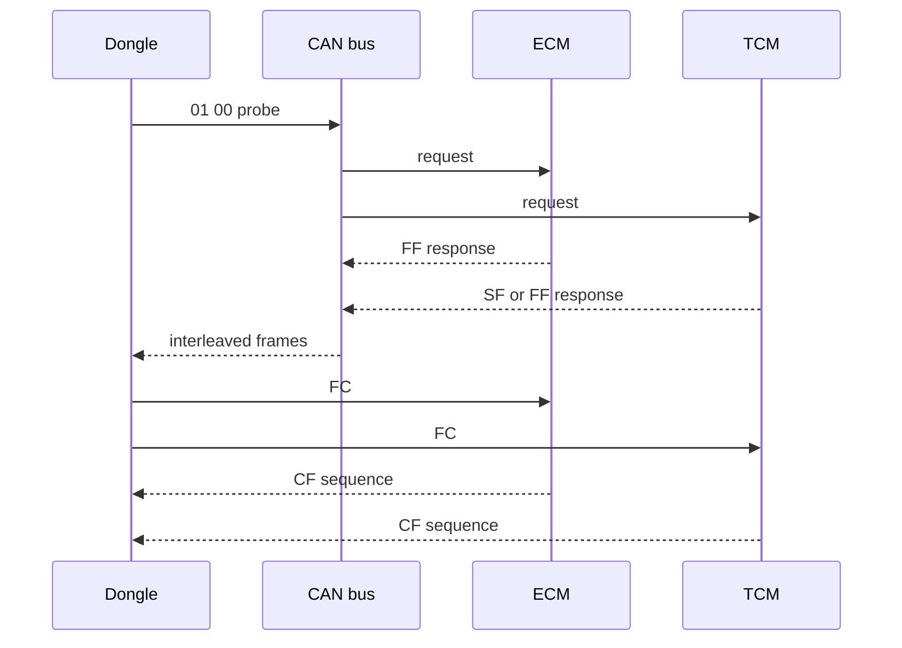

# OBD-II CAN Protocol Auto-Detection Plan

## 1. Objective

Teach the dongle to determine the active OBD-II CAN configuration before
issuing the user's OBD request. The detector identifies:

- CAN bitrate: 500 kbit/s or 250 kbit/s.
- CAN identifier format: 11-bit or 29-bit.

The detector remains inside the secure sequential architecture: it may transmit
only as part of an authenticated, whitelisted OBD transaction. Power-on or an
unauthenticated BLE event must never cause a CAN request.

Candidates are tested in this deterministic order:

```text
1. 500 kbit/s + 11-bit IDs
2. 500 kbit/s + 29-bit IDs
3. 250 kbit/s + 11-bit IDs
4. 250 kbit/s + 29-bit IDs
```

The first candidate that produces a structurally valid OBD response becomes the
selected protocol for the session.

## 2. Existing implementation and impact

The current firmware already has the correct high-level boundaries:



CAN assumptions are currently distributed in the lower layers:

- `TwaiCan` is fixed at 250 kbit/s.
- `Mcp2515Can` accepts a bitrate but has no runtime reconfiguration API.
- `CanFrame` has no standard/extended identifier flag.
- `Obd2Can` always sends to `0x7DF` and accepts `0x7E8`–`0x7EF`.
- `IsoTpClient` calculates flow-control IDs using 11-bit `response - 8` logic.
- `ATDP` and `ATDPN` report fixed protocol information.
- `main.cpp` initializes CAN before the secure request flow begins.

This is a medium/high-impact change in CAN and ISO-TP, but it should not
require rewriting the secure BLE or task layers.

## 3. Protocol model

Create one centralized configuration object for the selected session:

```cpp
enum class CanBitrate : uint8_t { K250, K500 };
enum class CanIdFormat : uint8_t { Standard11, Extended29 };

struct CanProtocol {
    CanBitrate bitrate;
    CanIdFormat idFormat;
    uint32_t functionalRequestId;
    uint32_t responseMin;
    uint32_t responseMax;
};
```

The final structure may use an address-policy object rather than fixed ranges,
because extended response IDs are not equivalent to the 11-bit
`0x7E8`–`0x7EF` range. Request IDs, response matching, identifier format, and
ISO-TP flow-control addressing must be selected together.



## 4. Candidate configurations

The candidate table must be centralized, not assembled inside individual CAN
backends.

| Candidate | Bitrate | ID format | Functional request | Response policy |
|---|---:|---|---|---|
| `CAN_500_11` | 500 kbit/s | 11-bit | `0x7DF` | `0x7E8`–`0x7EF` |
| `CAN_500_29` | 500 kbit/s | 29-bit | `0x18DB33F1` | ISO extended family |
| `CAN_250_11` | 250 kbit/s | 11-bit | `0x7DF` | `0x7E8`–`0x7EF` |
| `CAN_250_29` | 250 kbit/s | 29-bit | `0x18DB33F1` | ISO extended family |

The extended response matcher must be implemented from the selected OBD
addressing policy. It must not accept every 29-bit CAN frame as an OBD reply.

## 5. Detection request and validation

The probe is the mandatory supported-PIDs request:

```text
OBD service:       01
PID:               00
Positive response: 41 00 A B C D
```

The typical 8-byte CAN payload is:

```text
02 01 00 00 00 00 00 00
```

Padding bytes are not semantically relevant. The detector accepts a candidate
only when all of these checks pass:

1. The identifier format matches the candidate.
2. The response ID belongs to the candidate response policy.
3. ISO-TP PCI is valid.
4. The reassembled OBD payload begins with `41 00`.
5. Four supported-PID bitmap bytes are present.



## 6. Detector state machine

The detector is bounded. It must never retry indefinitely or leave the CAN
controller using an unknown candidate.



Recommended initial limits:

```text
probe response timeout: 100–200 ms
maximum candidates: 4
controller reset between candidates: mandatory
session re-detection: only after reset or explicit bus failure
```

## 7. CAN controller changes

### 7.1 `CanFrame`

Add identifier-format information:

```cpp
struct CanFrame {
    uint32_t id;
    uint8_t dlc;
    bool extended;
    uint8_t data[8];
};
```

Every frame creation site must initialize `extended` explicitly. Standard
11-bit should be the intentional default, not an accidental assumption.

### 7.2 `ICanBus`

Change the interface to accept protocol configuration:

```cpp
virtual bool begin(const CanProtocol& protocol) = 0;
virtual bool reconfigure(const CanProtocol& protocol) = 0;
virtual bool send(const CanFrame& frame) = 0;
virtual bool receive(CanFrame& frame) = 0;
virtual bool getStatus(CanStatus& status) = 0;
```

`reconfigure()` must leave the controller reset or stopped if configuration
fails. It must not silently continue using the previous candidate.

### 7.3 TWAI backend

`TwaiCan` must:

- Select the 500 kbit/s or 250 kbit/s timing configuration.
- Set the TWAI extended-frame bit for 29-bit messages.
- Preserve identifier format on receive.
- Stop/reinstall or safely reconfigure between candidates.
- Expose bus state and error counters where the ESP32 TWAI API allows it.

### 7.4 MCP2515 backend

`Mcp2515Can` must:

- Reuse its existing bitrate configuration for both rates.
- Set or clear the extended-ID flag in the MCP2515 frame representation.
- Preserve identifier format on receive.
- Reset and return to normal mode between candidates.
- Report controller error state where the library supports it.

The SN65HVD230 is a 3.3 V CAN transceiver; bitrate and standard/extended
identifier selection belong to the ESP32 or MCP2515 controller configuration,
not to the transceiver.

## 8. ISO-TP addressing changes

The current ISO-TP implementation assumes 11-bit OBD addressing. Replace
implicit arithmetic with address-policy methods:

```cpp
struct IsoTpAddressing {
    bool acceptsResponse(uint32_t id, bool extended) const;
    uint32_t flowControlTarget(uint32_t responseId) const;
    bool requestIsExtended() const;
};
```



For 11-bit OBD addressing, the existing `responseId - 8` rule can remain in
the 11-bit policy. It must not be applied to extended IDs.

## 9. `Obd2Can` integration

`Obd2Can` should own the selected protocol for the current session, while the
detector owns candidate selection:



The first OBD operation after secure validation calls `ensureProtocol()`. Once
selected, later OBD operations reuse the protocol and do not probe again.
`ATD` or an explicit session reset clears the selection.

## 10. ELM327 behavior

The ELM327 layer should remain unaware of the four CAN candidates. It sees an
OBD backend that may perform initialization before the request:

```text
authenticated command
  → ELM syntax validation
  → OBD whitelist validation
  → Obd2Can.ensureProtocol()
  → protocol detection if needed
  → original OBD request
  → multi-ECU ISO-TP collection
  → formatted response + >
```

`ATDP` and `ATDPN` must report the selected protocol. Before detection, they
should report an explicit unknown state rather than claiming `CAN 11/500`.

`ATD` resets ELM settings and clears protocol selection. It must not transmit a
probe by itself unless that behavior is explicitly defined for the product.

## 11. Security and safety rules

The detector transmits a CAN probe, so it obeys the same security boundary as
every other CAN request.



Rules:

- No probe at boot.
- No probe from unauthenticated input.
- No raw protocol-selection command from the client.
- No unbounded retries.
- No acceptance based only on CAN error state.
- Reset the controller between candidate configurations.
- Keep one active CAN transaction at a time.
- Keep `01 00` available as an internal read-only detector probe.

The probe is read-only, but it still transmits on the vehicle bus and is
therefore a security-relevant action.

## 12. Simulator changes

The Arduino simulator should become a test target for all four candidates.

Required changes:

- Select bitrate through compile-time or serial configuration.
- Support standard and extended request IDs.
- Return the corresponding response-ID family.
- Keep ECM and TCM state separate.
- Add configurable response delay and jitter.
- Add a mode that interleaves multi-frame responses from both ECUs.
- Add fault injection for dropped CFs, wrong sequence numbers, delayed CFs,
  malformed payloads, and negative responses.



The current simulator processes ECU responses synchronously. It is useful for
basic compatibility, but it does not fully model interleaving. The native
`FakeCanBus` tests remain the deterministic test for arbitrary frame order.

## 13. Test strategy

### Unit tests

- Candidate ordering is deterministic.
- A valid 11-bit/500 kbit/s response selects the first candidate.
- Wrong bitrate advances to the next candidate.
- Wrong identifier format advances to the next candidate.
- A malformed `41 00` response is rejected.
- A response with the wrong response ID is rejected.
- All candidates failing returns a bounded failure.
- Extended identifiers are preserved through send and receive.
- Extended flow-control addressing does not use `response - 8`.
- `ATDP` and `ATDPN` reflect the selected protocol.
- `ATD` clears protocol selection.

### ISO-TP tests

- 11-bit single-frame response.
- 29-bit single-frame response.
- 11-bit multi-frame response.
- 29-bit multi-frame response.
- Two ECUs with interleaved first/consecutive frames.
- Delayed consecutive frame.
- Wrong sequence number.
- Flow-control sent to the correct ECU for both ID formats.

### Hardware-in-the-loop matrix

| Bitrate | IDs | ECU count | Response type | Expected result |
|---:|---|---:|---|---|
| 500k | 11-bit | 1 | SF | Select and read |
| 500k | 11-bit | 2 | SF + SF | Select and collect both |
| 500k | 11-bit | 2 | FF/CF + SF | Select and collect both |
| 500k | 29-bit | 1 | SF | Select and read |
| 250k | 11-bit | 1 | SF | Select and read |
| 250k | 29-bit | 1 | FF/CF | Select and reassemble |
| any | any | 0 | no response | Exhaust candidates safely |

## 14. Observability

Detection should expose enough state to diagnose installation problems without
printing every CAN frame:

```text
candidate index
bitrate
ID format
probe start/end time
CAN controller error state
TX result
response ID
validation result
final selected protocol
```

Use structured debug logging behind a compile-time flag. Never log secure
payloads or long-term keys. Detailed diagnostics belong in the debug channel;
the ELM response remains protocol-compatible.

## 15. Performance and limits

At most four probe requests are sent. The detector uses a short probe timeout
and resets before the next candidate. Worst-case initialization time is
approximately:

```text
4 × (probe timeout + controller reset time)
```

With a 200 ms probe timeout, this is roughly 800 ms plus reconfiguration
overhead. A successful common case should complete after the first candidate.

The detector must not interfere with the existing `ATST` response quiet timer.
`ATST` controls response collection after protocol selection; detection has its
own bounded probe timeout.

## 16. Implementation phases

### Phase 1 — protocol types

- Add `CanProtocol`, bitrate, ID-format, and address-policy types.
- Add the extended flag to `CanFrame`.
- Add unit tests for protocol matching and ID conversion.

### Phase 2 — backend configuration

- Make TWAI configurable for 250/500 kbit/s and standard/extended IDs.
- Make MCP2515 preserve standard/extended IDs and reconfigure safely.
- Add controller status reporting.

### Phase 3 — ISO-TP generalization

- Replace implicit 11-bit arithmetic with address-policy methods.
- Preserve multi-ECU collection for both ID formats.
- Add extended-ID tests.

### Phase 4 — detector

- Implement `CanProtocolDetector`.
- Add strict `01 00` response validation.
- Add bounded retries and controller reset between candidates.

### Phase 5 — integration

- Integrate `ensureProtocol()` into `Obd2Can`.
- Update `ATDP`, `ATDPN`, `ATD`, and `ATH1`.
- Ensure detection is reachable only after secure and whitelist validation.

### Phase 6 — simulator and hardware validation

- Add four simulator configurations.
- Add interleaving and fault-injection modes.
- Run the hardware-in-the-loop matrix.
- Validate against a real vehicle only after bench testing.

## 17. Acceptance criteria

The feature is complete when:

1. The dongle selects all four combinations in the simulator.
2. No CAN probe occurs before authenticated, whitelisted input.
3. A wrong candidate is abandoned and the controller is reset before retry.
4. Both 11-bit and 29-bit ISO-TP requests and responses work.
5. Multi-ECU collection remains correct after detection.
6. `ATDP`, `ATDPN`, and `ATH1` describe the selected configuration.
7. Detection failure is bounded and returns the ELM prompt.
8. Unit and hardware-in-the-loop tests cover successful, invalid, delayed, and
   absent responses.
