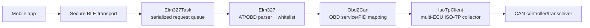

# Dongle ↔ App Capability Catalog

This catalog describes the current `feature/elm327-multi-ecu-isotp` firmware and the mobile app as they exist locally. It distinguishes three cases:

- **Handled**: the app can request and interpret the capability.
- **Dongle-only**: the firmware provides it, but the app is not prepared for it.
- **Mocked/duplicated**: the app has a fake or fixture for behavior that the dongle already provides.

## Runtime flow



The security layer must authenticate a request before `Elm327` sees it. `Elm327` then validates the ELM command and whitelist, performs one synchronous CAN transaction, and returns a response ending in `>`.

## Dongle surface and app coverage

### ELM327 commands

| Dongle provides | App status | Notes |
|---|---|---|
| `ATZ` | **Handled** | App initialization uses it. |
| `ATE0` | **Handled** | App disables echo. |
| `ATDP` | **Partly handled** | App displays the protocol string, but currently assumes a fixed protocol description. |
| `ATI`, `AT@1` | **Dongle-only** | App does not expose adapter identification commands. |
| `ATH0`, `ATH1` | **Dongle-only** | The dongle can expose ECU/CAN headers; app parsers do not preserve them. |
| `ATL0`, `ATL1` | **Dongle-only** | Line formatting is not configurable from the app. |
| `ATS0`, `ATS1` | **Dongle-only** | Space formatting is not configurable from the app. |
| `ATD`, `ATDPN` | **Dongle-only** | App does not use or display protocol-number selection. |
| `ATSThh` | **Dongle-only** | App does not tune the response timeout. |
| `AT?` for rejected/unsupported commands | **Partly handled** | App generally treats `?` as an unavailable result, not as a structured capability/error. |
| Unsafe protocol/configuration commands | **Intentionally unavailable** | Commands such as `ATSP`, `ATPC`, `ATAT`, `ATAR`, `ATAL`, `ATM`, `ATCAF`, and `ATRV` are not part of the secure subset. |

### OBD services and PIDs

| Dongle provides | App status | Gap or limitation |
|---|---|---|
| Service `01` live data | **Mostly handled** | The app has domain entries for the whitelisted value PIDs. |
| Service `01` PID `00/20/40/60` supported-PID bitmaps | **Handled internally** | The app uses them for discovery, but does not expose the raw bitmap as domain data. |
| Service `01` PID `01` monitor/MIL status | **Partly handled** | Used for MIL state, but not modeled as a complete raw response or per-ECU result. |
| Service `01` PID `02` freeze-frame origin DTC | **Dongle-only as a direct PID** | The app obtains the origin through Mode 02 flow instead of exposing this service-01 PID. |
| Services `03`, `07`, `0A` DTC lists | **Partly handled** | The app parses the first matching response and merges codes into one aggregate list. It does not retain ECU ownership. |
| Service `02` freeze-frame data | **Partly handled** | The app reads origin plus PIDs `04`, `05`, `0C`, `0D`, `0F`, and `11`; it does not offer arbitrary supported Mode 02 PIDs. |
| Mode `04` clear DTC | **Not provided by design** | This is intentionally not whitelisted because it changes vehicle state. |
| Optional response-count suffix, e.g. `010C1` | **Dongle-only** | The dongle can stop after the requested number of complete ECU responses; the app never sends the suffix. |

## Capabilities the dongle has that the app cannot safely consume yet

### 1. Multiple ECU responses

The firmware can collect responses per ECU and return multiple response lines. The app currently searches for the first `41xx`, `42xx`, `43`, `47`, or `4A` marker and treats the following bytes as one response. It therefore cannot reliably:

- preserve which ECU supplied a value;
- distinguish two ECUs returning the same PID;
- aggregate DTCs while retaining ECU ownership;
- report that one expected ECU did not answer;
- safely parse multiple response lines when headers or line breaks are enabled.

### 2. Mixed single-frame and multi-frame responses

The dongle's ISO-TP collector supports an ECU returning a single frame while another ECU returns a first frame followed by consecutive frames. The app has no response model for this distinction: it only receives normalized text and assumes one logical payload per command. A single ECU's already-reassembled response may work, but interleaved multi-ECU output is not a supported app contract.

### 3. ECU/CAN identity

With `ATH1`, the dongle can return identifiers such as `7E8` and `7E9`. The app strips formatting and headers, so the identity is lost before it reaches the domain layer. `Obd2Reading`, `DtcSnapshot`, and freeze-frame entries have no ECU identifier field.

### 4. Completion semantics

The dongle supports both quiet-time completion and an expected-response count. The app waits only for the final `>` prompt and does not know whether completion came from a timeout, an expected-count short circuit, or a partial response set. It also has no explicit “partial/missing ECU” state.

### 5. Timeout and transport configuration

`ATST` is implemented in the dongle, but the app has no setting or policy for it. The app also does not expose the difference between no response, CAN error, malformed ISO-TP, and a valid empty result.

### 6. Security variant compatibility

The active app data source currently wraps BLE with the static-PSK encrypted connection. Handshake helper/test files exist locally, but they are not the same as proving production interoperability with every firmware security variant, especially handshake-plus-replay-counter mode. The app must select one protocol and validate its framing, nonce/session-key derivation, counter direction, and failure behavior against the firmware.

## What the app already mocks or duplicates

| App mock/fixture | Real dongle capability it represents | Assessment |
|---|---|---|
| `FakeObd2Repository` telemetry readings | Service `01` PID reads | Useful for UI tests, but it can return arbitrary values without validating ELM syntax, whitelist, timing, or CAN behavior. |
| `FakeObd2Repository` DTC snapshot | Services `03`, `07`, `0A`, MIL state, and freeze-frame presentation | Represents the UI aggregate, not the dongle's per-ECU response structure. |
| Scripted ELM responses for `ATZ`, `ATE0`, `ATDP`, `0100`, live PIDs, DTCs, and freeze frames | Current textual ELM contract | Covers single-response happy paths only; it does not model multi-line, ECU headers, interleaving, timeout completion, `ATST`, or response-count suffixes. |
| Dashboard example values and conversion formulas | Firmware `Obd2Mock`/simulator values and OBD PID formulas | Good for rendering tests; these are duplicated data, not a second implementation of CAN behavior. |
| App DTC definitions/catalog | Decoding and display of DTC codes | This is domain metadata. It is not evidence that the dongle produced the listed codes. |
| App static-PSK BLE fixtures | Dongle encrypted transport | Useful for transport tests, but not sufficient to validate handshake/replay-counter firmware. |

## Most important compatibility change

The app should stop treating an ELM response as one unstructured byte string. The minimum shared model should represent each response line explicitly:

```text
ElmResponseSet
  request
  responses[]
    ecuId
    service
    pid or dtcMode
    payload
    frameKind / transportStatus
  completionReason: quietTimeout | expectedCount | noData | error
```

Then:

1. `Elm327Client` preserves ELM lines and the final prompt.
2. The data source parses headers and payloads into `ElmResponseSet`.
3. The repository decides whether to aggregate values or expose them per ECU.
4. UI models can show a value, its ECU source, and partial-result warnings.

## Priority order

1. **P0 — response parsing:** support multiple lines, headers, mixed single/multi-frame results, and explicit completion/error states.
2. **P0 — security interoperability:** integrate and test the selected handshake/replay protocol in the production BLE data source; do not silently fall back to plaintext.
3. **P1 — response-count optimization:** send `SSPPN`/`SSN` when the app has a valid expected count, while retaining timeout behavior for unknown counts.
4. **P1 — ECU-aware domain models:** add ECU identity to telemetry, DTC, and freeze-frame results.
5. **P2 — useful AT support:** expose adapter/protocol diagnostics only where they cannot alter vehicle behavior; keep configuration-changing commands rejected.
6. **P2 — test realism:** add fixtures for two ECUs, interleaved ISO-TP, one single-frame plus one multi-frame response, missing ECU, malformed frame, and timeout completion.

## Relevant implementation locations

### Firmware

- `esp32-firmware/src/elm327/Elm327.cpp` — command parsing, formatting, and whitelist boundary.
- `esp32-firmware/src/tasks/Elm327Task.cpp` — serialized request queue and prompt lifecycle.
- `esp32-firmware/src/obd2/real/Obd2Can.cpp` — service/PID request mapping and response formatting.
- `esp32-firmware/src/obd2/real/IsoTpClient.cpp` — ISO-TP framing, flow control, and multi-ECU collection.
- `esp32-firmware/src/obd2/IObd2.h` — OBD abstraction used by the ELM layer.

### Mobile app

- `mobile-app/lib/src/data/datasources/elm327_client.dart` — BLE command serialization and prompt collection.
- `mobile-app/lib/src/data/datasources/obd2_datasource.dart` — live PID parsing and supported-PID discovery.
- `mobile-app/lib/src/data/datasources/dtc_datasource.dart` — DTC and freeze-frame parsing.
- `mobile-app/lib/src/data/repositories/obd2_repository_impl.dart` — aggregate application behavior.
- `mobile-app/lib/src/domain/obd2/` — current app-facing models, which lack ECU identity and completion metadata.
- `mobile-app/test/support/` and `mobile-app/test/data/datasources/` — fake repository and scripted ELM fixtures.

## Bottom line

The app can use the dongle for the common single-ECU happy path: initialization, supported-PID discovery, live data, DTC modes, and the selected freeze-frame PIDs. The principal mismatch is not missing OBD commands; it is that the dongle now has a richer response contract—multiple ECU identities, ISO-TP reassembly, response-count completion, and explicit timing—while the app still consumes a first-match text parser and aggregate models.
