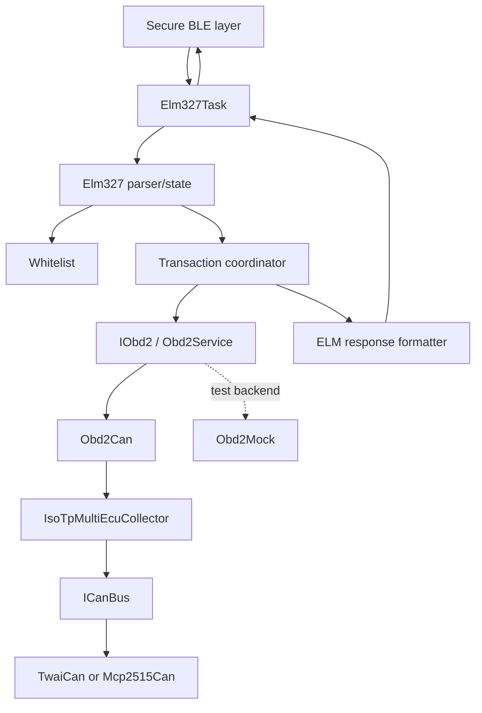
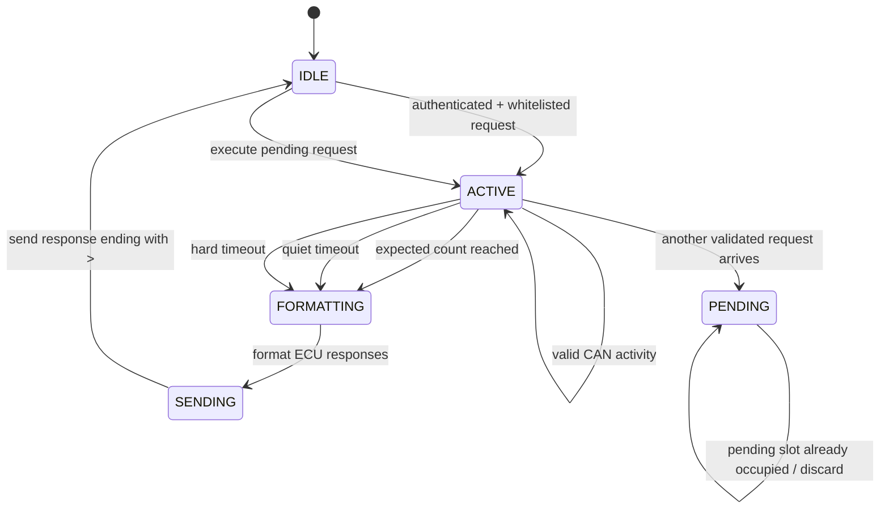
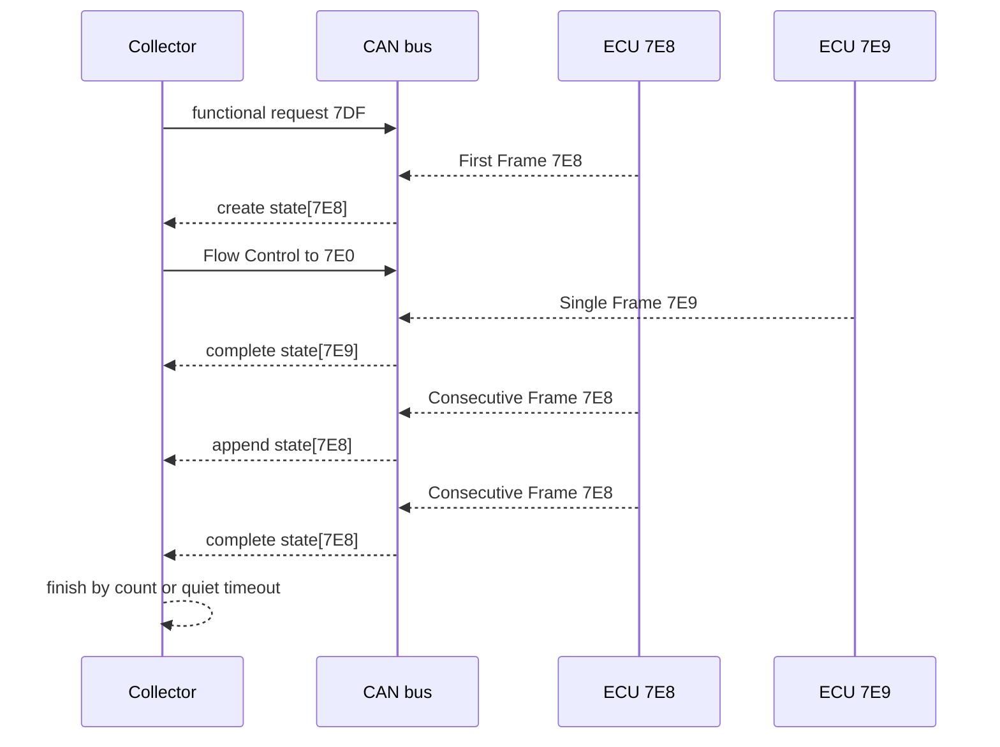

# Secure ELM327 Subset — Implementation Plan

## Objective

Implement a secure, sequential ELM327 subset that accepts only authenticated
and whitelisted commands, sends one CAN transaction at a time, supports
multi-frame ISO-TP responses, supports multiple responding ECUs, and uses the
ELM327 `>` prompt as the transaction boundary.

The security layer is assumed to have already authenticated the BLE message
before handing plaintext to `Elm327Task`.

## Layer model



Responsibilities:

- `Elm327Task`: serializes commands and sends responses.
- `Elm327`: parses ELM syntax and maintains local ELM settings.
- `Whitelist`: authorizes service/PID and service-only commands.
- `TransactionCoordinator`: owns the one-active-request rule.
- `IObd2`/`Obd2Can`: express and validate OBD operations.
- `IsoTpMultiEcuCollector`: routes CAN frames and reassembles responses.
- `ICanBus`: hides the physical CAN implementation.
- `Obd2Mock`: enables tests without CAN hardware.

## Command acceptance

The processing order is:

```text
authenticated plaintext
  → strict ELM syntax
  → local AT allowlist or OBD whitelist
  → transaction state check
  → CAN request
```

An invalid, unauthenticated, malformed, or non-whitelisted command must never
call `IObd2`, `Obd2Can`, `IsoTp`, or `ICanBus`.

### AT command subset

Local commands to support:

```text
ATZ       reset local state
ATI       identify firmware
AT@1      identify device
ATE0/1    echo off/on
ATL0/1    linefeeds off/on
ATS0/1    spaces off/on
ATH0/1    headers off/on, once real ECU IDs are preserved
ATD       restore defaults
ATDP      report the fixed protocol
ATDPN     report the fixed protocol number
ATSThh    configure the response quiet timeout
```

Commands that change protocol selection, addressing, monitoring, transmission,
or fabricated values remain rejected:

```text
ATSP...  ATPC  ATAT...  ATAR  ATAL  ATM...  ATCAF...  ATRV
```

Unknown commands return `?` locally and do not touch CAN.

### `ATST` behavior

`ATSThh` accepts exactly two hexadecimal digits. The value is interpreted using
the ELM327 timing unit of 4 ms:

```text
timeoutMs = max(1, hexValue(hh)) * 4
```

The default is `ATST32`, which represents 200 ms. The setting controls the
quiet-response timer: after receiving valid response activity, the collector
finishes when no new response activity arrives within this interval.

`ATST` must not change ISO-TP frame timeouts or the hard transaction deadline;
those remain safety and protocol limits. `ATZ` and `ATD` restore the default
200 ms value. Values outside the two-digit format are rejected.

## OBD command grammar

The parser accepts one service/PID request, optionally followed by a maximum
response count:

```text
SSPP       request and wait for the quiet timeout
SSPPN      request and stop after N complete ECU responses
SS         service-only request, such as DTC reading
SSN        service-only request with a response limit
```

Examples:

```text
010C       send service 01/PID 0C, wait for quiet timeout
010C1      send the same CAN request, stop after one ECU response
03         read confirmed DTCs, wait for quiet timeout
032        read confirmed DTCs, stop after two ECU responses
```

The response-count digit is local ELM control data and is not transmitted to
the ECU. `010C1` produces the CAN payload `01 0C`.

## Sequential transaction behavior



Only one CAN transaction is active. A validated command arriving during an
active transaction must not interrupt it. Keep at most one pending command and
start it only after the current response has reached a safe stop and the `>`
response has been emitted. The application should send its next command only
after observing `>`.

## Multi-ECU and multi-frame collection

Maintain one bounded ISO-TP state per response CAN ID:

```cpp
struct EcuIsoTpState {
    uint32_t responseId;
    bool active;
    bool complete;
    uint16_t expectedLength;
    size_t receivedLength;
    uint8_t nextSequence;
    uint8_t payload[MAX_RESPONSE_BYTES];
};
```



Rules:

1. A Single Frame completes immediately for its ECU.
2. A First Frame creates a state and causes a Flow Control frame for that ECU.
3. Consecutive Frames are routed by CAN ID and sequence-checked.
4. Interleaved ECU responses are supported.
5. A multi-frame response counts as one complete ECU response.
6. Unrelated frames are ignored by the active transaction, not blindly used.
7. The collector must have bounded ECU slots, payload sizes, and deadlines.

Use separate timing concepts:

- first-response timeout;
- ISO-TP consecutive-frame timeout;
- configurable quiet-response timeout from `ATST`;
- hard overall transaction deadline.

## Response result and formatting

The current single-payload result is insufficient. The CAN/OBD layers should
return a bounded collection:

```cpp
struct EcuResponse {
    uint32_t responseId;
    uint8_t data[MAX_RESPONSE_BYTES];
    size_t length;
};

struct ObdTransactionResult {
    EcuResponse responses[MAX_ECUS];
    size_t count;
    bool timedOut;
    bool malformed;
};
```

The collector returns reconstructed OBD payloads, not raw ISO-TP PCI bytes.
`Elm327` formats each ECU response as a separate logical ELM line.

With headers disabled:

```text
41 0C 1A F8
41 0C 1B 00
>
```

With headers enabled:

```text
7E8 04 41 0C 1A F8
7E9 04 41 0C 1B 00
>
```

`ATH1` must use the actual response CAN ID. It must not continue hardcoding
`7E8`.

For DTC services, retain ECU identity internally. When headers are enabled,
return separate ECU lines; when headers are disabled, use a deterministic
multi-line format or merge decoded DTCs according to an explicit policy.

## Layer modifications

### `Elm327`

- Add strict parser for optional response-count suffix.
- Add `_responseTimeoutMs`, defaulting to 200 ms.
- Implement exact `ATSThh` parsing and reset behavior.
- Keep only the approved AT subset.
- Delegate OBD work to the transaction coordinator.
- Format multiple ECU responses and append one final `>`.

### `Elm327Task`

- Preserve serialized command processing.
- Support one pending validated command at most.
- Never start a new request before the previous response is complete.

### `Whitelist`

- Keep service/PID and service-only rules centralized.
- Validate the OBD command before creating a CAN transaction.
- Keep AT authorization separate from OBD authorization.

### `IObd2` / `Obd2Can`

- Replace single-payload return values with bounded transaction results, or
  introduce a dedicated multi-response service.
- Preserve response CAN IDs.
- Validate response service/PID per ECU.
- Keep OBD decoding separate from ISO-TP frame assembly.

### `IsoTpClient`

- Add a multi-ECU collector.
- Route frames by response ID.
- Support interleaved Single, First, and Consecutive Frames.
- Send Flow Control per ECU.
- Add sequence validation, bounded buffers, and independent timeouts.
- Avoid indiscriminate queue draining.

### `ICanBus` implementations

- Keep transport APIs non-blocking.
- Preserve CAN IDs and DLC correctly.
- Make bitrate and CAN addressing configurable where required.

## Tests

Unit tests should cover:

- AT allow/reject behavior.
- `ATST` parsing, default reset, and 4 ms conversion.
- Response-count parsing and removal before CAN transmission.
- Whitelist rejection with zero CAN transmissions.
- One ECU Single Frame.
- One ECU multi-frame response.
- Two ECU Single Frames.
- One multi-frame ECU plus one Single Frame ECU.
- Two interleaved multi-frame ECUs.
- Bad sequence numbers and missing frames.
- Quiet timeout and response-count early completion.
- Actual ECU ID formatting with `ATH1`.
- Pending-command behavior during an active transaction.
- Every response path ending with `>`.

Integration tests should cover the simulator and hardware-in-the-loop paths,
especially multi-ECU DTC responses and commands with response-count suffixes.
