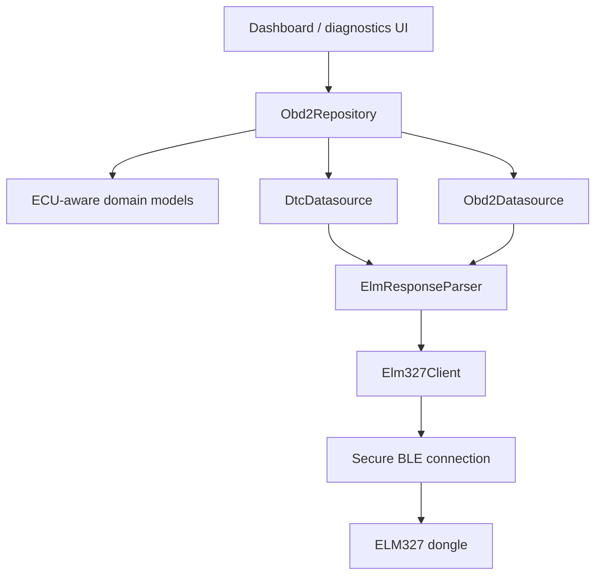

# Mobile App Increment Plan

## Goal

Evolve the mobile app from a single-response ELM327 client into a secure, ECU-aware client that can consume the dongle's multi-ECU and ISO-TP responses without breaking the existing live-data, DTC, and freeze-frame flows.

## Target architecture



The important boundary is `ElmResponseParser`: raw ELM text should be parsed once into structured responses, rather than each datasource searching for the first service/PID marker independently.

## Phase 0 — establish the contract

Document and test the exact firmware contract before changing UI behavior.

Define:

```text
ElmCommand
  text
  service
  pid or diagnostic mode
  expectedResponseCount?

ElmResponseSet
  responses[]
    ecuId?
    service
    pid or diagnostic mode
    payload
    rawLine
  completionReason
  transportError?
```

Supported completion reasons should include:

- `expectedCount`
- `quietTimeout`
- `noData`
- `rejected`
- `malformed`
- `transportError`

Acceptance criteria:

- Existing single-line responses still parse exactly as before.
- A response ending in `>` is the only successful command boundary.
- A new request is not sent while the previous response is incomplete.

## Phase 1 — secure transport integration

Before expanding protocol parsing, make sure every production request uses the selected secure firmware protocol.

Tasks:

1. Choose one production protocol: static PSK, handshake session keys, or handshake plus replay counter.
2. Align app and firmware framing, nonce sizes, HKDF inputs, authentication tags, and counter direction.
3. Remove or disable the plaintext fallback in the production data source.
4. Return typed security failures instead of converting them into generic `?` or empty data.
5. Add tests for invalid tag, wrong nonce/session, replayed frame, counter gap, and reconnect/session reset.

Acceptance criteria:

- No unauthenticated ELM command reaches the dongle.
- Replay protection is verified across repeated and reordered messages.
- A failed secure request leaves the dongle ready for the next valid request.

## Phase 2 — robust ELM client

Modify `Elm327Client` so it preserves the response structure instead of returning only normalized text.

Tasks:

- Keep command serialization with one in-flight request.
- Read until the final `>` prompt.
- Preserve line boundaries and raw response text.
- Detect `NO DATA`, `?`, CAN errors, and timeout text explicitly.
- Add optional response-count suffix generation (`SSPPN` / `SSN`).
- Expose `ATST` only through a safe typed configuration, not arbitrary AT text.
- Keep unsupported and vehicle-changing AT commands unavailable.

Tests:

- Prompt arrives after one line.
- Prompt arrives after multiple ECU lines.
- Delayed response near the timeout boundary.
- Response arrives while the app is attempting a second request.
- Rejected command does not leave stale bytes in the next response.

## Phase 3 — response parser and ECU identity

Create `ElmResponseParser` and use it from both OBD and DTC datasources.

The parser should support:

- headers enabled: `7E8 06 41 0C ...`;
- headers disabled: `06 41 0C ...`;
- multiple ECU lines for one request;
- single-frame and already-reassembled multi-frame payloads;
- mixed one-frame and multi-frame ECU responses;
- malformed or incomplete lines;
- raw-line retention for diagnostics.

Do not infer ECU identity from payload bytes. Use the header when present; otherwise represent the ECU as unknown.

Acceptance criteria:

- Two ECUs responding to one PID produce two structured responses.
- A single-frame response and a multi-frame response can coexist.
- One malformed ECU response does not corrupt another ECU's response.

## Phase 4 — ECU-aware domain models

Extend the app models without forcing the UI to change immediately.

Suggested models:

```text
Obd2Reading
  pid
  value
  ecuId?
  rawPayload

DtcEntry
  code
  status
  ecuId?

FreezeFrameEntry
  pid
  value
  ecuId?
  originDtc?

DtcSnapshot
  entries[]
  freezeFrames[]
  milOn
  completion
  warnings[]
```

Repository behavior:

- Preserve all ECU responses internally.
- Continue exposing aggregate values for existing dashboard widgets.
- Define a deterministic duplicate policy, preferably `all`, with an explicit primary-value policy only where the UI requires one.
- Surface partial results instead of silently presenting the first ECU response as complete.

## Phase 5 — OBD and diagnostic datasource changes

### Live data

- Send the existing PID request through the structured client.
- Use supported-PID discovery as today.
- Parse every matching ECU response.
- Preserve the first-response compatibility API temporarily.
- Add an ECU-aware API for new screens.

### DTCs

- Parse all responses from modes `03`, `07`, and `0A`.
- Keep DTC ownership by ECU.
- Merge only at the repository boundary.
- Distinguish no DTCs from no responding ECU.

### Freeze frames

- Keep the current origin-DTC and selected PID set.
- Parse all ECU responses.
- Associate each freeze-frame value with its ECU and origin DTC where available.
- Add arbitrary Mode 02 PID support only after supported-PID discovery and whitelist agreement are defined.

## Phase 6 — useful safe AT support

Add only commands that inspect or format responses without changing vehicle behavior:

- `ATI` and `AT@1` for adapter information;
- `ATDP` and `ATDPN` for protocol information;
- `ATH1` for diagnostics and ECU identity;
- `ATST` through a bounded timeout setting.

Do not add app controls for:

- protocol forcing;
- CAN monitor/transmit modes;
- header/filter changes that could enable spoofing;
- voltage control or arbitrary AT passthrough;
- DTC clearing.

## Phase 7 — UI and state handling

Update screens only after the parser and models are stable.

Display:

- adapter/protocol information;
- ECU source where known;
- multiple values for the same PID when applicable;
- partial-result and timeout warnings;
- DTC status grouped by ECU when available;
- freeze-frame values grouped with their origin DTC.

The dashboard may continue showing one selected value, but that selection must be explicit and testable rather than “first response wins.”

## Phase 8 — test matrix

### Client and parser

- one ECU, single frame;
- one ECU, multi-frame;
- two ECUs, both single-frame;
- two ECUs, both multi-frame;
- one single-frame plus one multi-frame ECU;
- interleaved response lines;
- headers on and off;
- expected-count completion;
- quiet-time completion;
- missing ECU;
- malformed frame;
- CAN/transport error;
- prompt interruption by a new command.

### Application behavior

- live PID aggregate remains backward compatible;
- DTCs from multiple ECUs are not dropped;
- freeze-frame values retain source ECU;
- partial results are visible to repository/UI;
- no request is issued before the previous `>` prompt;
- secure failure blocks the request and does not poison the next request.

### Hardware/system tests

- real BLE secure session;
- real dongle with one ECU simulator;
- two simulated ECUs;
- mixed ISO-TP traffic;
- reconnect and session-key rotation;
- replayed encrypted frame;
- timeout under bus load.

## Delivery order

1. Add contract types and parser tests.
2. Integrate secure protocol and remove plaintext production fallback.
3. Refactor `Elm327Client` to return structured responses.
4. Refactor OBD/DTC datasources to consume the parser.
5. Add ECU-aware domain fields with backward-compatible repository methods.
6. Add response-count optimization and bounded `ATST`.
7. Update UI and diagnostics screens.
8. Run simulator and hardware matrix; document any vehicle-specific limitations.

## Definition of done

The app is ready when it can authenticate every request, wait for the prompt boundary, parse all ECU responses from a command, handle mixed ISO-TP response types, preserve ECU identity when available, report partial/error completion explicitly, and retain compatibility with the current single-ECU dashboard flows.
