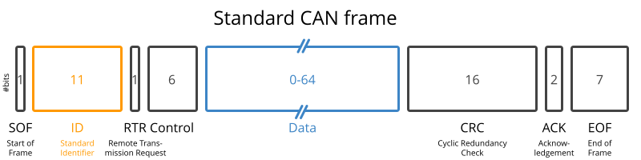
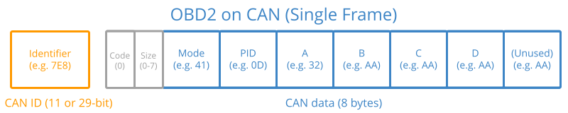

# CAN e OBD-II

CAN (Controller Area Network) é o sistema de comunicação usado em veículos que permite que as diferentes unidades computacionais presentes em um automóvel (ECUs) comuniquem-se de maneira confiável. OBD-II é um sistema de auto-diagnóstico padronizado por lei em todos os veículos produzidos no Brasil a partir de 2010, que define um protocolo de requisição e resposta em cima do CAN de modo a permitir que uma ferramenta externa comunique-se com as ECUs do automóvel, solicitando dados (como leitura de sensores) ou DTCs (códigos de autodiagnóstico).

Este texto resumirá os principais detalhes técnicos que envolvem estes dois conceitos e que são necessários para o entendimento do código neste repositório.

## CAN Bus

É a rede responsável por conectar as diferentes ECUs do carro. Possui topologia de barramento, com broadcast orientado a mensagens: qualquer módulo pode colocar uma mensagem no barramento, e todos escutam. Para evitar colisões, é feita a arbitragem: quando dois módulos tentam transmitir ao mesmo tempo, o de maior prioridade vence, enquanto os outros recuam automaticamente até o barramento ficar livre novamente.

Cada mensagem CAN é estruturada em campos bem definidos, conforme imagem abaixo (extraída do [artigo da CSS Electronics](https://www.csselectronics.com/pages/can-bus-simple-intro-tutorial)):

 

Os campos de interesse são o ID, que definem a mensagem e sua prioridade (IDs menores possuem maior prioridade), e o DATA, que contém o conteúdo da mensagem de fato. Os outros campos servem, entre outros, a propósitos de integridade e confiabilidade.

Há duas variações possíveis e comumente encontrada em veiculos: o bitrate e o tamanho do campo ID. O campo ID pode conter 11 ou 29 bits, e o bitrate pode ser de 250 Kbps ou 500 Kbps, a depender da implementação. A ISO 15765-4 fornece recomendação de como implementar uma inicialização sistemática que identifica automaticamente estes parâmetros a serem utilizados na comunicação com a rede CAN subjacente.

## OBD-II 

É um protocolo construído acima do CAN, que permite comunicação no estilo requisição-resposta. Dado que o OBD-II utiliza o CAN, existem IDs CAN padronizados para o OBD-II. No caso do CAN com ID de 11 bits, as requisições seguem:

* ID 0x7DF é utilizado para broadcast a todos ECUs compatíveis com OBD-II.
* Intervalo 0x7E0 - 0x7E7 endereça ECUs específicos (menos comum).

Já as respostas OBD-II possuem ID no intervalo 0x7E8 - 0x7EF.

Como visto na seção CAN, o campo DATA de uma mensagem CAN comporta apenas 8 bytes. O protocolo ISO-TP (ISO 15765-2) especifica como as mensagens OBD-II são organizadas dentro desse campo e viabiliza mensagens maiores que 8 bytes ao fragmentá-las em múltiplas transmissões. Neste texto será explorado apenas o caso em que os dados cabem em um único quadro CAN (Single Frame ou SF).

A organização da mensagem OBD-II dentro do campo DATA é a seguinte, em que cada quadrado representa um byte (imagem extraída do [artigo da CSS Electronics](https://www.csselectronics.com/pages/obd2-explained-simple-intro)):

O OBD-II expõe serviços (definidos no Byte "Mode"). O serviço 0x01, por exemplo, representa a aquisição de dados em tempo real. Cada serviço contém Parameter IDs (definidos no Byte "PID"). 

Na requisição, o serviço é incluso diretamente (ex. 0x01). Na resposta, 0x40 é adicionado ao serviço (ex. resposta à requisição de um PID do serviço 0x01 conterá 0x41 no campo "Mode").

O serviço 0x01 possui ~200 PIDs padronizados. Os veículos, entretanto, não precisam dar suporte a todos; a maioria dá suporte a apenas um pequeno subconjunto. Porém, o PID 0x00 para o serviço 0x01 é especial: se a ECU dá suporte a qualquer serviço OBD2, obrigatoriamente deve dar suporte a ele. Este padrão se repete a cada 0x20.

Ou seja: em resposta à requição pelo PID 0x00, responde-se se existe suporte aos PIDs 0x01 ~ 0x20. Em resposta à requisição pelo PID 0x20, responde-se se existe suporte aos PIDs 0x21~0x40.... E por aí vai.

TODO: escrever aqui um exemplo de requisição e um exemplo de resposta.

Referências

* [CAN Bus: A Simple Intro (CSS Electronics)](https://www.csselectronics.com/pages/can-bus-simple-intro-tutorial)
* [OBD2 Explained: A Simple Intro (CSS Electronics)](https://www.csselectronics.com/pages/obd2-explained-simple-intro)

