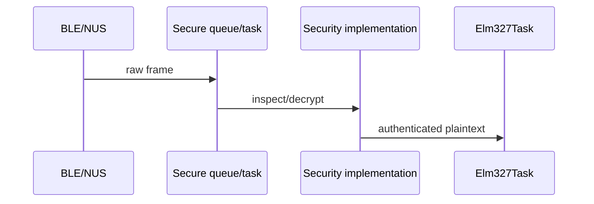

# Secure BLE layer

The base decorator owns the FreeRTOS queue and delivers a frame to one of the
security implementations. Only authenticated plaintext reaches `Elm327Task`.

The plain transport remains available for development builds. Production builds
should select either `USE_SECURE_PSK` or `USE_SECURE_HANDSHAKE_REPLAY`.
