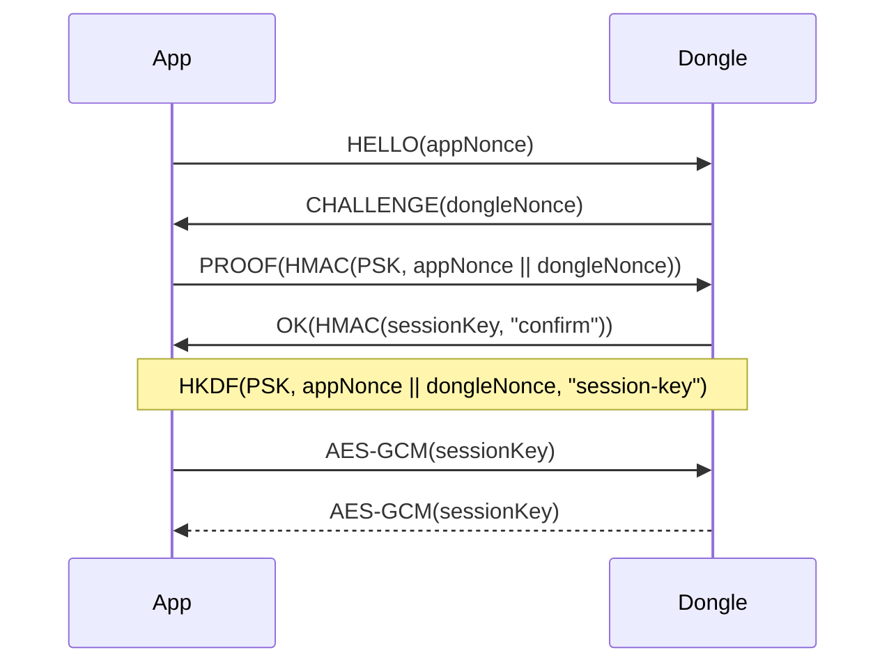

# Handshake session security

This mode authenticates both sides with the PSK and derives a fresh AES-256
session key from fresh nonces. It deliberately has no message counter.

A new `HELLO` discards the previous session and creates a new key.
