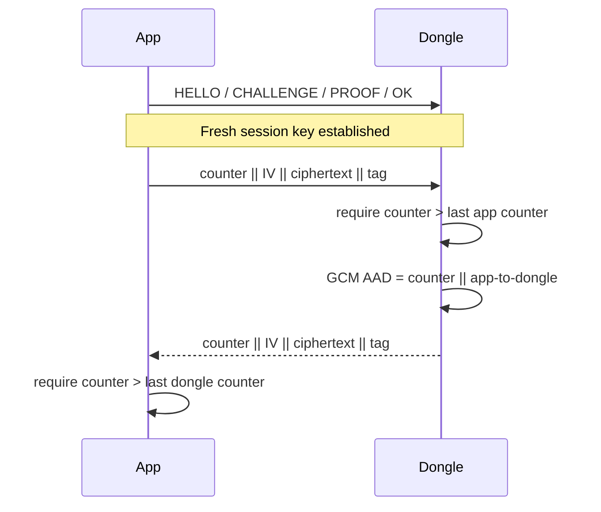

# Handshake with intra-session replay protection

This mode uses the same nonce exchange and session-key derivation as
`handshake`, then adds an independent strictly increasing counter per
direction. The counter and direction are authenticated as GCM AAD.

Replayed or older frames are discarded. Counters reset with a new handshake.
