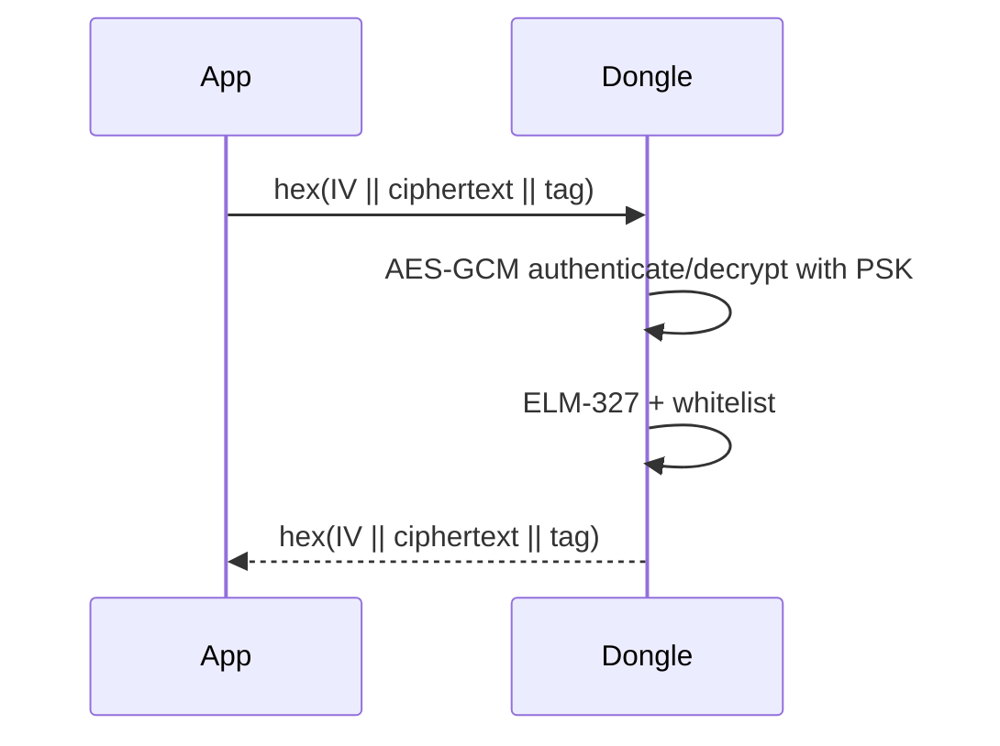

# Static PSK

This mode uses the long-term `SECURE_PSK_HEX` directly for AES-256-GCM. Every
message gets a random 12-byte IV and is sent as hex `IV || ciphertext || tag`.

It provides confidentiality and integrity, but has no session key or replay
counter. Use handshake-replay when replay resistance is required.
