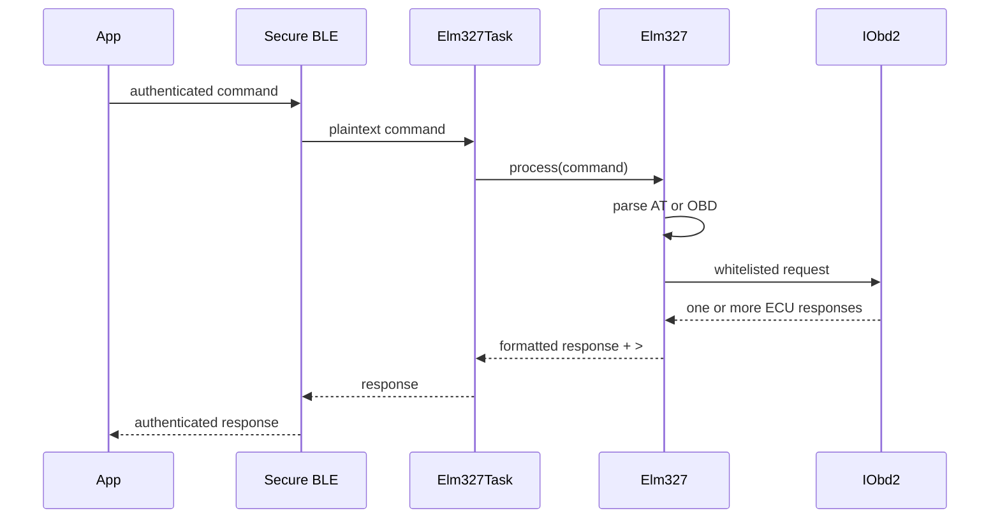

# ELM327 layer

`Elm327` is the protocol boundary after secure BLE validation. It accepts a
small local AT subset and whitelisted OBD requests; only OBD requests call
`IObd2`. `Elm327Task` serializes commands and sends exactly one response ending
in `>` before the next queued command is processed.

OBD syntax is `SSPP` or `SSPPN`, and service-only DTC syntax is `SS` or
`SSN`; `N` is the optional number of complete ECU responses expected. With no
`N`, the OBD layer waits for its configured quiet timeout. `ATSThh` controls
that timeout in 4 ms units (`ATST32` is 200 ms). It does not change ISO-TP
per-frame deadlines.

`ATH1` reports the CAN ID captured from each ECU. The AT allowlist is local and
does not permit protocol selection, address injection, raw transmission, or
fabricated voltage/status commands.
