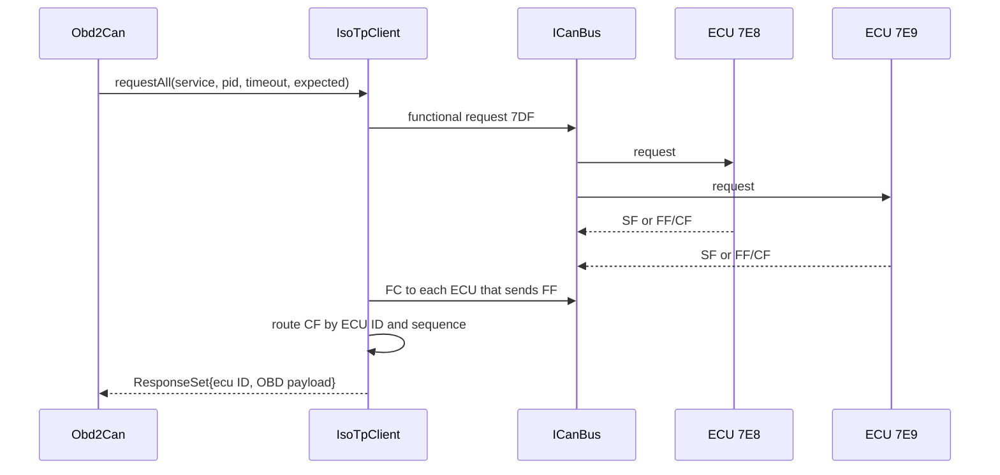

# Real OBD-II over CAN

`Obd2Can` maps the ELM327 OBD operations to functional request ID `0x7DF` and
response IDs `0x7E8`–`0x7EF`. `IsoTpClient` owns ISO-TP framing and collects
responses independently by ECU ID.

The collector resets the quiet-response timer after valid activity. It stops
early when the optional response count is complete; otherwise it returns after
the quiet timeout. ISO-TP `N_CR` remains independent, so an incomplete
multi-frame ECU response cannot extend the global wait indefinitely.

The fixed-size response set avoids heap allocation on the ESP32 and supports
up to eight response ECUs with up to 256 reassembled payload bytes each.
`request()` remains as a single-response compatibility wrapper over
`requestAll()`.
