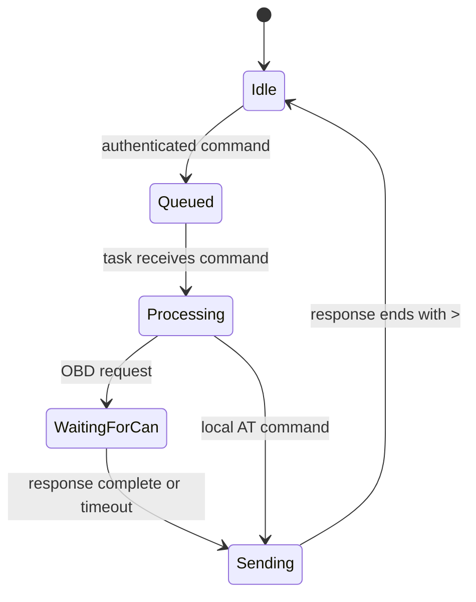

# ELM327 task

`Elm327Task` is the concurrency boundary. BLE callbacks only copy incoming
data into a FreeRTOS queue; the task calls `Elm327::process()` synchronously.
That preserves the strict rule that a new request cannot start while the
previous response is still being collected, formatted, or sent.

