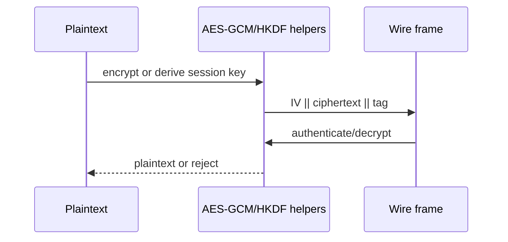

# Mobile cryptography

`psk_cipher.dart` provides AES-256-GCM with a random 12-byte IV. `hkdf.dart`
provides HMAC-SHA256, HKDF-SHA256, constant-time comparison, and zeroization.

```mermaid
sequenceDiagram
    participant P as Plaintext
    participant G as AES-GCM/HKDF helpers
    participant W as Wire frame
    P->>G: encrypt or derive session key
    G->>W: IV || ciphertext || tag
    W->>G: authenticate/decrypt
    G-->>P: plaintext or reject
```
