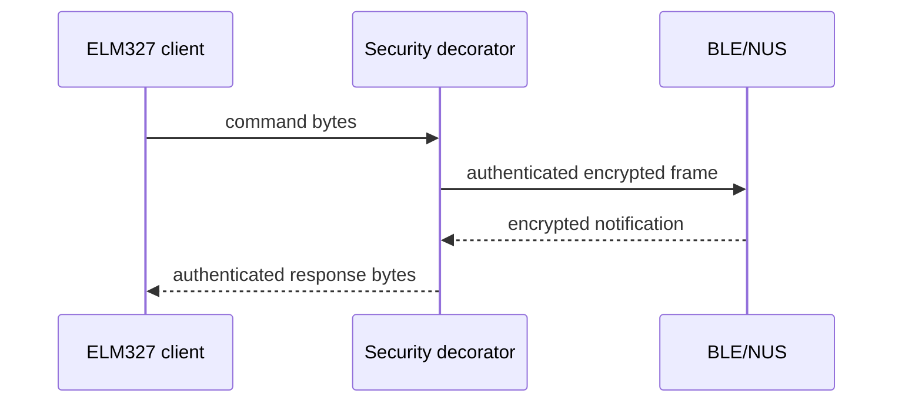

# BLE security flow

The app wraps the raw NUS connection with a security decorator. The decorator
owns framing and cryptography; the ELM327 client sees only plaintext bytes.

`ble_security_handshake.dart` defines the nonce/HMAC/HKDF handshake protocol.
`encrypted_ble_connection.dart` currently implements the static-PSK transport;
the replay-counter transport must use the same counter/AAD format as the
firmware `handshake_replay` implementation.
